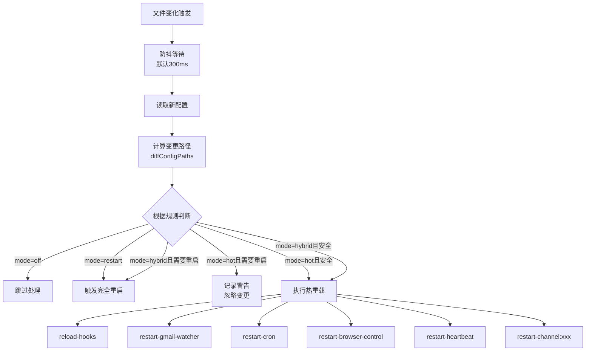

# openclaw.json 热加载机制技术分析报告

## 概述

OpenClaw 项目**已完整实现** `openclaw.json` 的热加载机制。配置文件变更会被自动检测并根据预定义规则决定是热重载还是触发完全重启。

---

## 核心实现

### 文件监听

使用 `chokidar` 库监听 `openclaw.json` 文件变化：

```typescript
// src/gateway/config-reload.ts:390-407
const watcher = chokidar.watch(opts.watchPath, {
  ignoreInitial: true,
  awaitWriteFinish: { stabilityThreshold: 200, pollInterval: 50 },
  usePolling: Boolean(process.env.VITEST),
});
```

配置文件路径通过 `CONFIG_PATH` 环境变量或系统默认值解析。

### 重载模式

支持四种重载模式，通过 `gateway.reload.mode` 配置：

| 模式      | 配置项                                 | 行为                           |
| --------- | -------------------------------------- | ------------------------------ |
| `off`     | `gateway.reload.mode: "off"`           | 不自动重载配置                 |
| `restart` | `gateway.reload.mode: "restart"`       | 任何配置变更都触发完全重启     |
| `hot`     | `gateway.reload.mode: "hot"`           | 只热重载支持的路径，其他忽略   |
| `hybrid`  | `gateway.reload.mode: "hybrid"` (默认) | 尽可能热重载，无法热重载才重启 |

### 防抖和缓存

- **防抖延迟**：默认 300ms（可配置 `gateway.reload.debounceMs`）
- **配置缓存**：默认 200ms（可配置 `OPENCLAW_CONFIG_CACHE_MS`）

```typescript
// src/config/io.ts:1267-1289
const DEFAULT_CONFIG_CACHE_MS = 200;
```

---

## 配置路径重载规则

### 核心重载规则

| 配置路径                    | 重载类型 | 动作                    |
| --------------------------- | -------- | ----------------------- |
| `gateway.remote`            | none     | -                       |
| `gateway.reload`            | none     | -                       |
| `hooks.gmail`               | hot      | restart-gmail-watcher   |
| `hooks`                     | hot      | reload-hooks            |
| `agents.defaults.heartbeat` | hot      | restart-heartbeat       |
| `agent.heartbeat`           | hot      | restart-heartbeat       |
| `cron`                      | hot      | restart-cron            |
| `browser`                   | hot      | restart-browser-control |
| `meta`                      | none     | -                       |
| `identity`                  | none     | -                       |
| `wizard`                    | none     | -                       |
| `logging`                   | none     | -                       |
| `models`                    | none     | -                       |
| `agents`                    | none     | -                       |
| `tools`                     | none     | -                       |
| `bindings`                  | none     | -                       |
| `audio`                     | none     | -                       |
| `agent`                     | none     | -                       |
| `routing`                   | none     | -                       |
| `messages`                  | none     | -                       |
| `session`                   | none     | -                       |
| `talk`                      | none     | -                       |
| `skills`                    | none     | -                       |
| `ui`                        | none     | -                       |
| `plugins`                   | restart  | 完全重启                |
| `gateway`                   | restart  | 完全重启                |
| `discovery`                 | restart  | 完全重启                |
| `canvasHost`                | restart  | 完全重启                |

### 重载规则分类

#### 需要完全重启的路径

以下配置变更会触发 gateway 完全重启：

- `plugins` - 插件配置
- `gateway` - gateway 核心配置
- `discovery` - 发现服务配置
- `canvasHost` - Canvas Host 配置

#### 支持热重载的路径

以下配置变更可以热重载（无需重启 gateway）：

- `hooks` - hooks 配置（热重载 hooks）
- `hooks.gmail` - Gmail hooks（重启 gmail-watcher）
- `cron` - 定时任务（重启 cron 服务）
- `browser` - 浏览器控制（重启 browser-control）
- `agents.defaults.heartbeat` / `agent.heartbeat` - 心跳配置（重启 heartbeat）

#### 无需重载的路径（立即生效）

以下配置变更不需要任何重载：

- `meta` - 元数据
- `identity` - 身份配置
- `logging` - 日志配置
- `models` - 模型配置
- `agents` - Agent 配置
- `tools` - 工具配置
- `bindings` - 绑定配置
- `audio` - 音频配置
- `agent` - Agent 相关
- `routing` - 路由配置
- `messages` - 消息配置
- `session` - 会话配置
- `talk` - 对话配置
- `skills` - 技能配置
- `ui` - UI 配置

---

## 通道插件扩展

通道插件可以通过 `reload` 字段声明自定义重载规则：

```typescript
// src/channels/plugins/types.plugin.ts:58
export type ChannelPlugin<...> = {
  // ...其他字段
  reload?: { configPrefixes: string[]; noopPrefixes?: string[] };
  // ...
};
```

### 实现示例

插件在注册时通过 `reload.configPrefixes` 声明需要热重载的配置路径前缀，通过 `reload.noopPrefixes` 声明无需重载的配置路径前缀：

```typescript
// 来自 config-reload.test.ts 的示例
const telegramPlugin: ChannelPlugin = {
  id: "telegram",
  reload: { configPrefixes: ["channels.telegram"] },
  // ...
};

const whatsappPlugin: ChannelPlugin = {
  id: "whatsapp",
  reload: {
    configPrefixes: ["web"],
    noopPrefixes: ["channels.whatsapp"],
  },
  // ...
};
```

### 规则合并逻辑

热重载规则合并顺序：

1. **BASE_RELOAD_RULES** - 核心热重载规则
2. **ChannelReloadRules** - 通道插件动态规则
3. **BASE_RELOAD_RULES_TAIL** - 尾部规则（restart/none 类型）

```typescript
// src/gateway/config-reload.ts:105-122
const rules = [...BASE_RELOAD_RULES, ...channelReloadRules, ...BASE_RELOAD_RULES_TAIL];
```

---

## 热重载流程



---

## 关键文件

| 文件                                   | 职责                        |
| -------------------------------------- | --------------------------- |
| `src/gateway/config-reload.ts`         | 热重载核心逻辑              |
| `src/gateway/server.impl.ts`           | gateway 启动时配置 reloader |
| `src/config/io.ts`                     | 配置加载和缓存              |
| `src/channels/plugins/types.plugin.ts` | 通道插件 reload 接口定义    |
| `src/gateway/config-reload.test.ts`    | 热重载功能测试              |

---

## 类型定义

```typescript
// src/config/types.gateway.ts:170-177
export type GatewayReloadMode = "off" | "restart" | "hot" | "hybrid";

export type GatewayReloadConfig = {
  mode?: GatewayReloadMode;
  debounceMs?: number;
};
```

---

## 测试覆盖

`src/gateway/config-reload.test.ts` 包含以下测试场景：

| 测试                                                      | 描述                                    |
| --------------------------------------------------------- | --------------------------------------- |
| `captures nested config changes`                          | 嵌套配置变更检测                        |
| `captures array changes`                                  | 数组变更检测                            |
| `does not report unchanged arrays as changed`             | 相同对象数组不报告变更                  |
| `reports changed arrays of objects`                       | 对象数组变更报告                        |
| `marks gateway changes as restart required`               | gateway 变更标记为需要重启              |
| `restarts Gmail watcher for hooks.gmail changes`          | hooks.gmail 变更触发 gmail-watcher 重启 |
| `restarts providers when provider config prefixes change` | 插件配置前缀变更触发通道重启            |
| `treats gateway.remote as no-op`                          | gateway.remote 作为无操作               |

---

## 配置示例

```json5
{
  "gateway": {
    "reload": {
      "mode": "hybrid",
      "debounceMs": 300
    }
  },
  "hooks": { ... },  // 热重载
  "cron": { ... },    // 热重载 cron
  "models": { ... },  // 无需重载，立即生效
  "plugins": { ... }  // 需要完全重启
}
```

---

## 文档更新记录

已修正 `docs/gateway/configuration.md` 中的文档不一致：

- 原文档: `agent.heartbeat`
- 修正后: `agents.defaults.heartbeat`

---

## 总结

✅ **热加载机制已完整实现** - 文件监听、四种重载模式、防抖缓存机制均就绪
✅ **通道插件扩展支持** - 通过 `reload.configPrefixes` 和 `reload.noopPrefixes` 声明自定义规则
✅ **测试覆盖充分** - 所有核心场景都有对应测试用例
✅ **文档已同步** - 配置路径重载规则与代码实现一致

**建议模式**: 使用默认的 `hybrid` 模式以获得最佳体验

---

## 参考链接

- 源代码: `src/gateway/config-reload.ts`
- 配置文档: [https://docs.openclaw.ai/gateway/configuration#config-hot-reload](https://docs.openclaw.ai/gateway/configuration#config-hot-reload)
- 类型定义: `src/config/types.gateway.ts`
- 插件类型: `src/channels/plugins/types.plugin.ts`
